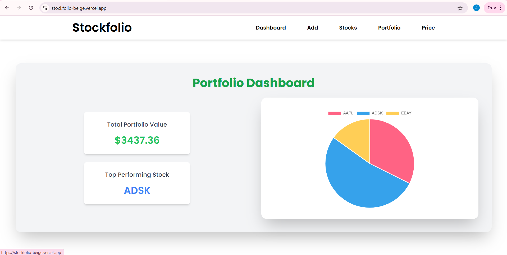
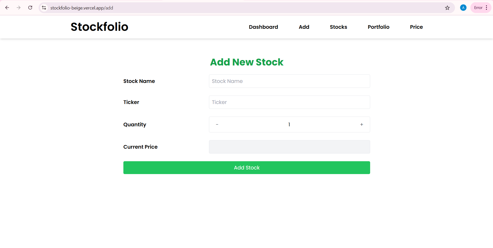
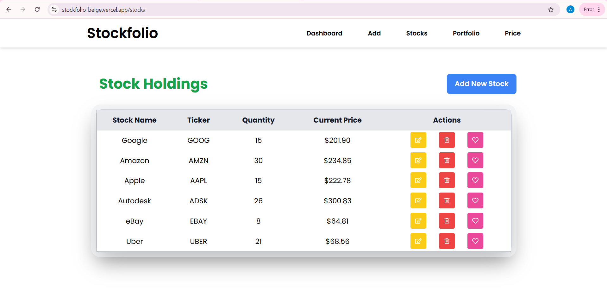
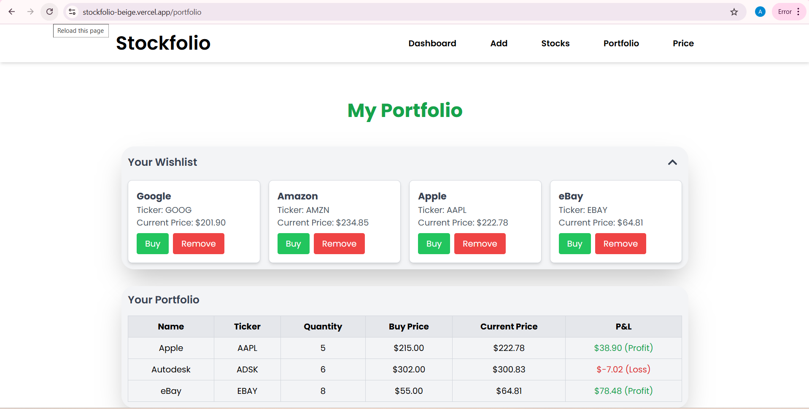
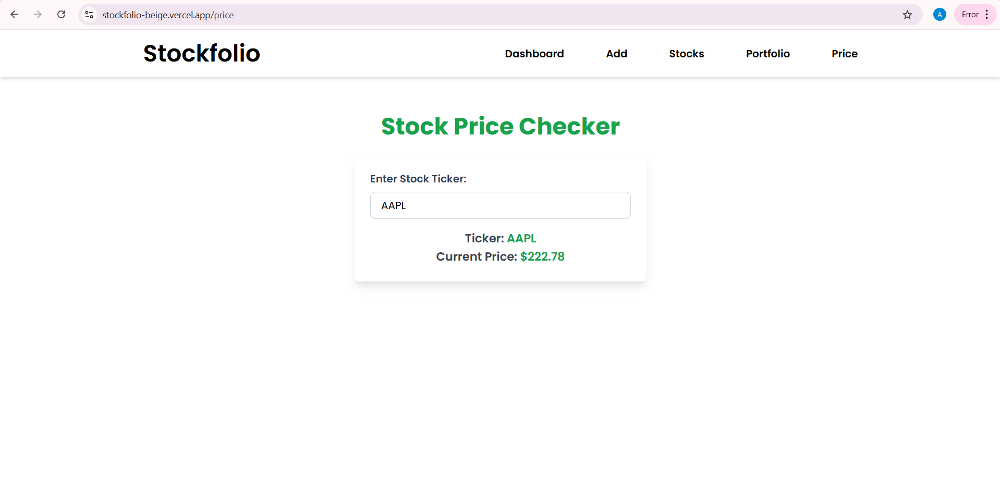

# Portfolio Tracker Application
A feature-rich web application designed to help users manage their stock portfolios, track real-time stock prices, and visualize performance metrics. Built with modern web technologies and deployed using cloud-based services, the application offers seamless and dynamic portfolio management.

## Features

### Frontend
**Dashboard:**
- Displays:
  - Total portfolio value updated in real-time.
  - Top-performing stock by percentage gain.
  - Portfolio distribution visualization with a responsive pie chart.

**Stock Management:**
- Add, edit, and delete stocks with an intuitive form-based interface.
- View and interact with a detailed table displaying stock details, including:
  - Stock name, ticker, quantity, buy price, current price, and P&L (Profit/Loss).

**Wishlist:**
- Save stocks for later tracking with local persistence using localStorage.
- Manage wishlist visibility and actions like removing stocks or buying from the wishlist.

**Real-Time Price Checker:**
- Fetch real-time stock prices using a ticker symbol with API integration.

**Responsive Design:**
- Built with React and TailwindCSS to provide a smooth experience across devices.

### Backend
**RESTful API:**
- Endpoints for CRUD operations on stocks and portfolio entries.
- Real-time stock price fetching using the Finnhub API.
- Dashboard API for portfolio insights, including:
  - Total portfolio value.
  - Top-performing stock.
  - Portfolio distribution.

**Dynamic Calculations:**
- Portfolio value and metrics updated dynamically using real-time stock prices.

**Security:**
- CORS configured to allow secure interaction with the frontend.

**Database:**
- PostgreSQL with JPA and Hibernate for efficient and scalable data management.

### Deployment
- **Frontend:** Hosted on Vercel.  
- **Backend:** Deployed on Render with a Dockerized image.  
- **Database:** Hosted on a PostgreSQL instance locally or via a cloud provider.  
- **Docker:** Backend containerized for portability and ease of deployment.

### Tech Stack

**Frontend:**
- React
- React Router
- TailwindCSS
- Framer Motion (for animations)
- Chart.js (for portfolio distribution pie chart)

**Backend:**
- Java with Spring Boot
- PostgreSQL
- JPA & Hibernate
- RestTemplate (for Finnhub API integration)

**APIs:**
- Finnhub API for fetching real-time stock prices.

**Deployment:**
- Frontend: Vercel
- Backend: Render
- Containerization: Docker

### Project Structure

**Frontend:**
```
src/
├── components/
│   ├── Dashboard.js         
│   ├── StockForm.js         
│   ├── StockTable.js        
│   ├── StockPrice.js        
│   ├── Portfolio.js         
│   └── NavBar.js            
├── App.js                   
└── index.js                 
```
**Backend:**
```
src/
├── main/
│   ├── java/com/example/portfolio_backend/
│   │   ├── configuration/    
│   │   ├── controller/       
│   │   ├── entity/           
│   │   ├── repository/       
│   │   ├── service/          
│   │   └── PortfolioBackendApplication.java 
│   └── resources/
│       ├── application.properties 
├──.env
└──Dockerfile
```

### Setup Instructions
**Prerequisites**
- Node.js and npm 
- Java 17 and Maven 
- PostgreSQL database
- Docker (for backend containerization)

**Frontend Setup**
1. Clone the frontend repository:
```bash
git clone https://github.com/Thenx0009/portfolio_frontend.git
cd portfolio-frontend
```
2.Install dependencies:
```bash
npm install
```
3.Start the development server
```bash
npm run dev
```
4. Access the app at `http://localhost:5173`.

**Backend Setup**
1. Clone the backend repository:
```bash
git clone https://github.com/Thenx0009/portfolio-backend.git
cd portfolio-backend
```
2. Configure the application.properties file:
```properties
spring.datasource.url=jdbc:postgresql://<db-host>:<db-port>/<db-name>
spring.datasource.username=<db-username>
spring.datasource.password=<db-password>
frontend.url=http://localhost:5173
```
3. Build the application:
```bash
mvn clean package
```
4. Run the backend server:
```bash
java -jar target/portfolio-backend-0.0.1-SNAPSHOT.jar
```
5. Access the server at `http://localhost:8080`.

**Docker Setup (Backend)**
1. Build the Docker image:
```bash
docker build -t portfolio-backend .
```
2. Run the Docker container
```bash
docker run -p 8080:8080 -e DATASOURCE_URL=<db-url> -e DATASOURCE_USER=<db-user> -e DATASOURCE_PASSWORD=<db-password> portfolio-backend
```

### API Endpoints

**Stocks:**

- `GET /api/stocks`: Fetch all stocks.
- `POST /api/stocks`: Add a new stock.
- `GET /api/stocks/{id}`: Fetch a stock by ID.
- `PUT /api/stocks/{id}`: Update stock details.
- `DELETE /api/stocks/{id}`: Delete a stock.

**Portfolio:**

- `GET /api/stocks/portfolio`: Fetch portfolio entries.
- `POST /api/stocks/portfolio`: Add a portfolio entry.

**Dashboard:**

- `GET /api/stocks/dashboard`: Fetch total portfolio value, top-performing stock, and distribution.

**Real-Time Prices:**

- `GET /api/stocks/real-time-price/{ticker}`: Fetch the real-time price of a stock.

### Deployment Links

- Frontend: [Portfolio Tracker Frontend](stockfolio-beige.vercel.app)
- Backend: [Portfolio Tracker Backend](https://portfolio-backend-latest-xngv.onrender.com)

### Screenshots
- Dashboard:
 
- Add Form: 
 
- Stock Management:
 
- Portfolio:
 
- Real-Time Price Checker:


## License 

This project is open-source and available under the [MIT License](LICENSE)